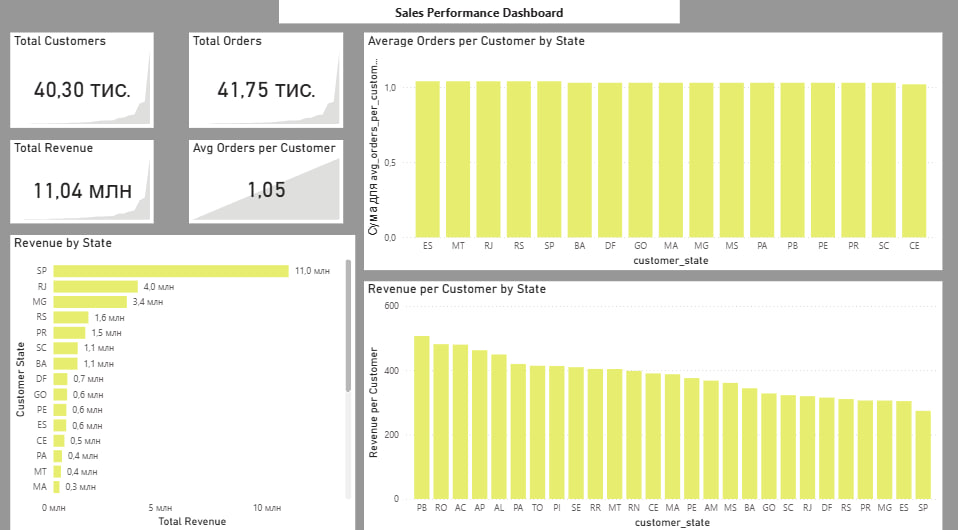

# Sales Performance Dashboard (Power BI)

## Project Overview

This project demonstrates the development of a Sales Performance Dashboard in Power BI with a focus on KPI design, data modeling, and state-level performance analysis.

The objective was to evaluate business performance, identify regional differences, and assess customer value using calculated metrics rather than relying solely on absolute totals.

---

## Dashboard Preview

---

## Data Modeling

The data model was built using a star schema structure, including:

- Fact table: Sales
- Dimension tables: Customers, Products, Date, Geography

Relationships were created to enable accurate aggregation and filtering across different dimensions.

---

## Key Performance Indicators (KPIs)

The dashboard includes the following KPIs:

- Total Sales
- Total Profit
- Profit Margin
- Sales by State
- Sales by Category
- Customer Segmentation

Custom DAX measures were created to calculate:

- Profit Margin %
- Year-over-Year Growth
- Average Order Value

---

## Tools & Technologies

- Power BI
- DAX (Data Analysis Expressions)
- Data Modeling (Star Schema)
- Data Visualization Best Practices

---

## Insights & Analysis

The dashboard allows users to:

- Compare performance across states
- Identify high-performing product categories
- Analyze profitability trends
- Evaluate customer contribution to revenue

The focus was placed on clarity, usability, and business-driven insights.

---

## Author

Sofiia Didenko
